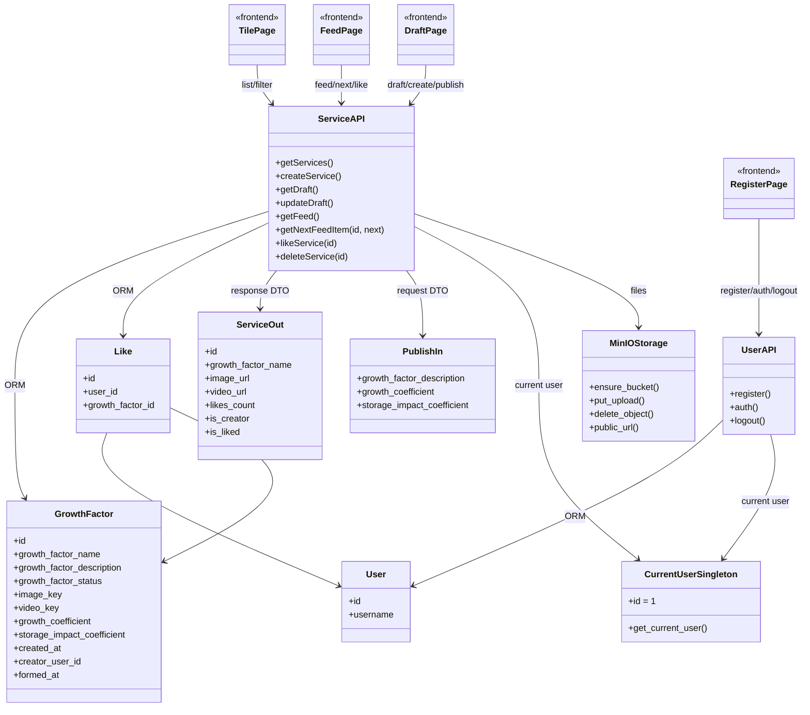

# Диаграмма классов ЛР3

## Зависимости страниц

| Фронтенд-страница | Домен      | Метод    | URL                                 | Назначение                     |
| ----------------- | ---------- | -------- | ----------------------------------- | ------------------------------ |
| Плитка            | `services` | `GET`    | `/api/services`                     | Получение списка услуг         |
| Лента             | `services` | `GET`    | `/api/services/feed`                | Получение ленты                |
| Лента             | `services` | `GET`    | `/api/services/feed/{id}?next=true` | Переход к следующей услуге     |
| Лента             | `services` | `POST`   | `/api/services/{id}/like`           | Поставить лайк                 |
| Добавление        | `services` | `GET`    | `/api/services/draft`               | Загрузка текущего черновика    |
| Добавление        | `services` | `POST`   | `/api/services`                     | Создание услуги                |
| Добавление        | `services` | `PUT`    | `/api/services/draft`               | Изменение/публикация черновика |
| Добавление        | `services` | `DELETE` | `/api/services/{id}`                | Удаление услуги                |
| Регистрация       | `users`    | `POST`   | `/api/users/register`               | Регистрация пользователя       |
| Регистрация       | `users`    | `POST`   | `/api/users/auth`                   | Авторизация пользователя       |
| Регистрация       | `users`    | `POST`   | `/api/users/logout`                 | Выход из системы               |

| Метод    | URL                                 | Описание                                                                                                                                             |
| -------- | ----------------------------------- | ---------------------------------------------------------------------------------------------------------------------------------------------------- |
| `GET`    | `/api/services`                     | Получение списка доступных опубликованных услуг для отображения на странице «Плитка». Возвращает данные услуг, необходимые для карточек.             |
| `POST`   | `/api/services`                     | Создание новой услуги. На сервере создаётся запись `GrowthFactor`, устанавливаются системные поля, включая `created_at` и `creator_user_id`.         |
| `GET`    | `/api/services/draft`               | Получение текущего черновика услуги пользователя. Используется для загрузки данных на страницу «Добавление».                                         |
| `PUT`    | `/api/services/draft`               | Обновление/публикация текущего черновика. Передаваемые данные описывают услугу и её коэффициенты; при публикации может устанавливаться `formed_at`.  |
| `GET`    | `/api/services/feed`                | Получение ленты опубликованных услуг. Используется страницей «Лента».                                                                                |
| `GET`    | `/api/services/feed/{id}?next=true` | Получение следующего элемента ленты относительно услуги с указанным `id`. Параметр `next=true` указывает направление перехода к следующему элементу. |
| `POST`   | `/api/services/{id}/like`           | Установка лайка текущим пользователем для указанной услуги. Создаётся запись в таблице `likes`.                                                      |
| `DELETE` | `/api/services/{id}`                | Удаление услуги. Как правило, изменяет или устанавливает статус услуги `удален`, а не обязательно физически удаляет запись из БД.                    |
